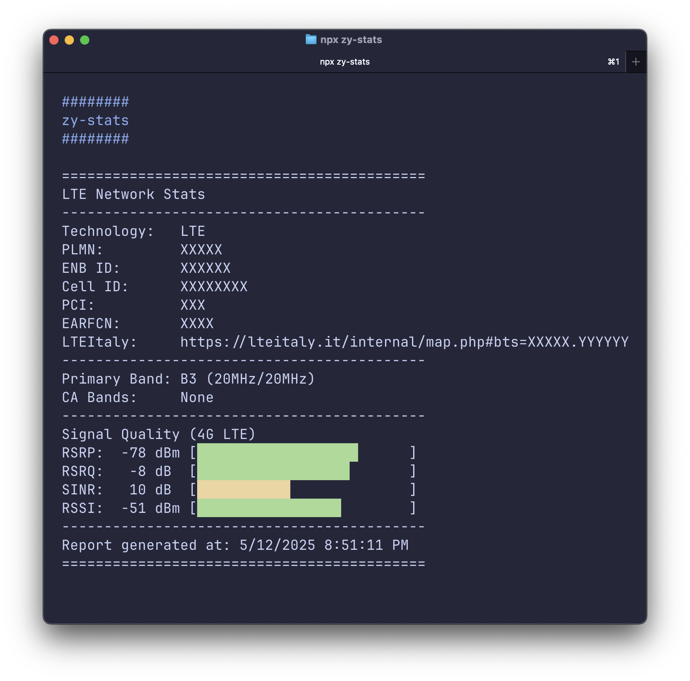

A few months ago I bought this 4G modem: [Zyxel LTE5398-M904](https://www.zyxel.com/products/mobile-broadband/4g-lte-a-pro-indoor-iad-lte5398-m904). It's a great device, and it works even better when paired with an external antenna.

Since then, I started learning a few things regarding how the 4G network works. In Italy, we have a very nice website where it's possible to check all the antennas across the country:
[lteitaly.it](https://lteitaly.it) (you will need to log in to see all the available information).

In the first weeks of use, I quickly realized that the connection wasn't always performing at its best (even with the external antenna), though it was always good enough for everyday use.

Thanks to [MioNonno's YouTube channel](https://www.youtube.com/@miononno), I discovered a really nice [hack](https://miononno.it/router/zyxel-lte5398-m904) to better monitor the modem's connection stats (click on the relative `hack` section on the website).

The hack is cool and simple to use, but after a few months, I grew tired of always having a browser tab open solely for that purpose. So I decided to create a very basic CLI tool based on the original `hack` script to fetch and display the same stats. I also thought it could be a fun way to test my Node.js knowledge after getting the [JSNAD](https://www.credly.com/badges/79186869-3dd9-4a84-81df-d24a3d810bd3).

The final result is available here: [ailequal/zy-stats](https://github.com/ailequal/zy-stats). The `README.md` contains all the necessary information to install and use the tool. Thanks to [Puppeteer](https://github.com/puppeteer/puppeteer) I was able to replicate a very simple login workflow that allows me to fetch the needed stats.

Among the available option flags that I have implemented, there is `--log` for logging the stats into a dedicated log file. While the Zyxel's web interface already offers some logging capabilities, this tool potentially gives you more control over it.

P.S. The code is far from perfect, but it works so far (at least with this specific Zyxel model), so I decided to publish it anyway.

P.S.S. Yes, I totally `vibe coded` a few sections of the code.
